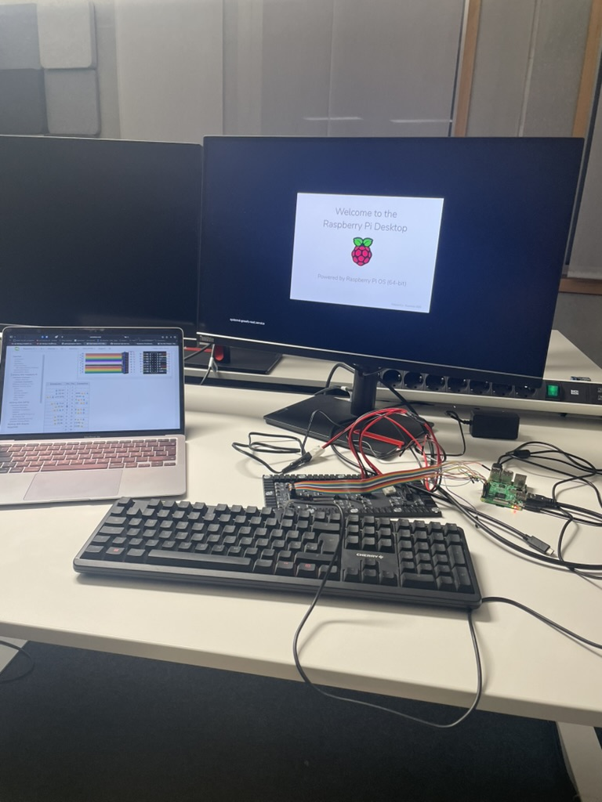
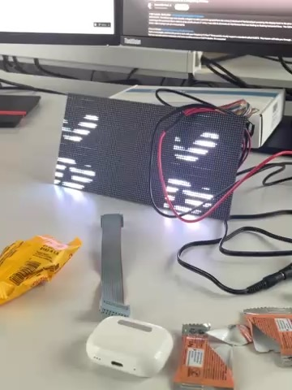
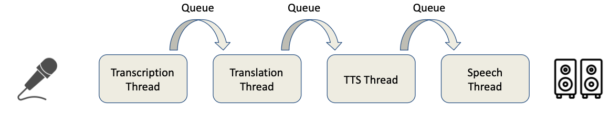
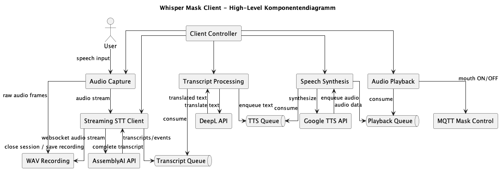
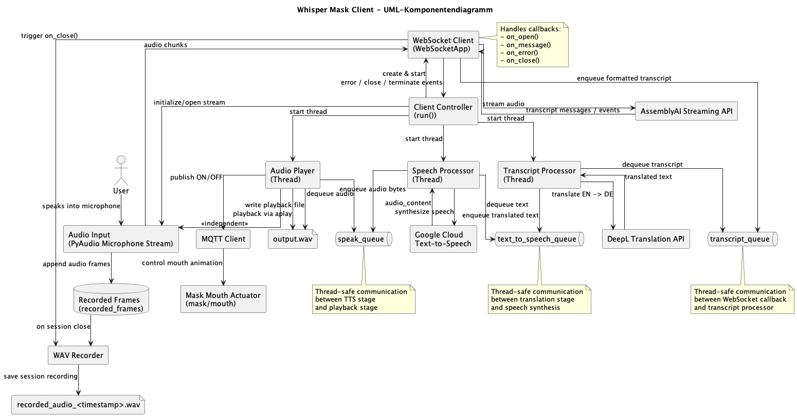

# Documentation of the whisper mask project
This is the central documentation repository for the whisper mask.

## User Interface
The code for the user interface (mouth) can be found here: https://github.com/OskarHM/rpi-rgb-led-matrix . It is a fork of the open source library: https://github.com/hzeller/rpi-rgb-led-matrix .
We have the most recent version already built on the raspberry Pi. 
The command to start the visualisation is: 
sudo ./demo -D13 --led-no-hardware-pulse --led-cols=96 --led-rows=48 --led-pwm-lsb-nanoseconds 130 --led-pwm-bits=11 --led-brightness=100 --led-slowdown-gpio=4 

We decided to integrate it inside the library so we can contribute it upstream because the mouth is a cool demo. D13 selects our demo case.

The hardware setup was quite tedious and is replacable with a specified HUB75E adapter which we also described in our report.
 

The incompatibility to other frameworks can be seen in this screenshot from a video:
 

## Translation pipeline
The source code for the translation pipeline can be found here: https://github.com/OskarHM/api-based-translation . There is also a branch for an improved local_text_to_speech which we did not use in our prototype.

The siemens-display-whisper-mask.local raspberry Pi has all dependencies already installed. You just need to source the virtual environment and run the python script.
 
Note: as this is API based you need to add the API-keys for the current services that we used. The translation and text to speech can be changed relatively quickly to another provider the transcription would be more complex. We used AssemblyAI for speech to text, DeepL API for the translation and Google API text to speech for speech synthesis. AssemblyAI and DeepL API are pretty straightforward to use, surprisingly the Google text to speech api was way worse and was not very intuitive. So in a next iteration we might want to replace GoogleAPI with a simpler to use service. 

All tokens we used where included in a free membership. This is one big advantage of the current AI race ;) and definitely invites to play with AI services.

The high level view can be found in the presentation:

This diagram shows an overview of the text to speech pipeline: 

This is a more in depth representation which is for persons that do not like to read code but want all the details(might take the same amount of time tough.)

## Batch based approach 
The batch based approach can be found here: https://github.com/Al-Nouiri/WhisperMask

## Communication
The communication and the remote development of the two raspberies is based on avahi.

The rapsberry controlling the User Interface is reachable under this address: 
whisperMask.local
password: swhiscool

The raspberry controlling the Translation is reachable under this address: 
siemens-display-whisper-mask.local
password: swh
